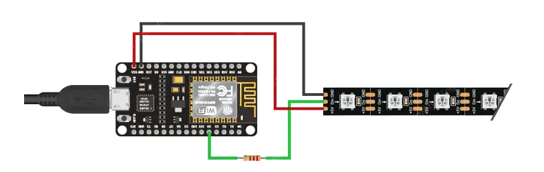

# 🌈 RGB LED Strip Control with ESP8266 and Alexa

This project allows you to control a **WS2812B (NeoPixel) LED strip** using an **ESP8266** integrated with **Amazon Alexa** through the [Espalexa](https://github.com/Aircoookie/Espalexa) library.

With this setup, you can:
- 📶 Connect the ESP8266 to your local Wi-Fi network  
- 🎨 Change the color, brightness, and intensity of the LED strip via Alexa voice commands  
- 💡 Create smart home automations for lighting (example: *"Alexa, turn the desk light blue"*)  

---

## 🔧 Technologies Used
- **ESP8266 / NodeMCU**  
- **Espalexa library** (Alexa integration)  
- **Adafruit NeoPixel** (WS2812B LED strip control)  
- **Arduino IDE / PlatformIO**  

---

## 🚀 How to Use

1. Clone this repository:
   ```bash
   git clone https://github.com/yourusername/esp8266-alexa-rgb.git
   cd esp8266-alexa-rgb

## Connection diagram


